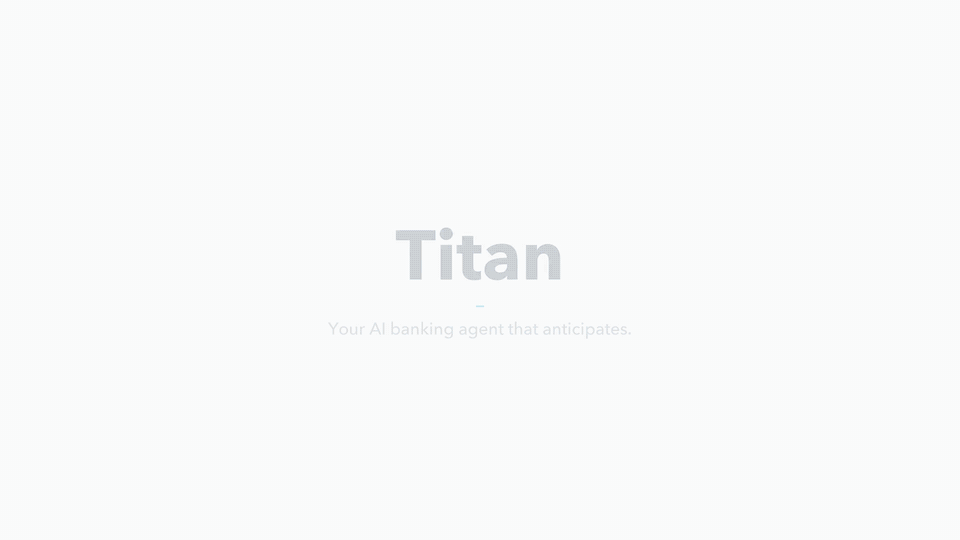
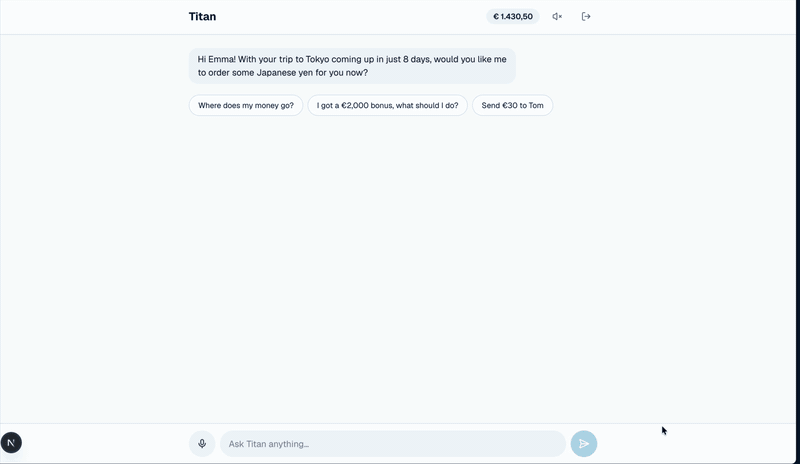

# Titan — the banking agent that anticipates

> **Tectonic Hackathon · KBC challenge** — *Kate answers. Titan anticipates.*

## 🔗 Try it live

### **[titan-o5vl2pt2pq-ew.a.run.app](https://titan-o5vl2pt2pq-ew.a.run.app)**

| Jury login | |
|---|---|
| Email | `jury@titan.demo` |
| Password | `azertyuiop123456!` |

*Demo account with fictional data. Try: "Where does my money go?", "I got a €2,000 bonus, what should I do?", "Send €30 to Tom", or tap 🎤 and just talk.*

## 🎬 Demo

| Concept (15 s) | Live app — real database (4× speed) |
|:---:|:---:|
| [](docs/media/titan-teaser.mp4) | [](docs/media/titan-live-demo.mp4) |
| [▶ Watch MP4](docs/media/titan-teaser.mp4) | [▶ Watch full 77 s MP4](docs/media/titan-live-demo.mp4) |

In the live demo, Emma checks her balance, moves €500 to savings, asks for investment advice, buys €600 of a world ETF and sends €50 to Tom — **every action confirmed by her**, balances updated live in the database.

## The challenge → our answer

KBC asked for a **scalable personalization approach** — not another feature. Titan gives every customer a personal AI banker that understands their situation and acts at the right moment.

| KBC question | Titan |
|---|---|
| **Which signals** show what customers need? | Transactions, balances, calendar (opt-in), goals, risk profile |
| **How to recognize** situation & intent? | Life-moment engine: upcoming trip, celebration, low balance, salary received |
| **How does it adapt** to each customer? | Titan **speaks first** with the one thing that matters now, in the customer's language |
| **Across products & channels?** | One agent for payments, savings, investing and FX — by text or voice (EN / NL / FR) |
| **Impact for millions?** | Explainable rules + one agent per customer: scales like software, not like advisors |

## What Titan does

| | Feature | Example |
|---|---|---|
| ✈️ | **Speaks first** | *"Your Tokyo trip is in 8 days — want yen at 162.4?"* |
| 💶 | **Understands spending** | *"Where does my money go?"* → breakdown by category |
| 📈 | **Invests by risk profile** | *"€2,000 bonus, house in 3 years"* → diversified plan + projection |
| 🛒 | **Acts with approval** | Transfers, savings, stocks → confirm card (with risk warning) → done |
| 🎙️ | **Voice** | Talk to Titan, hear the answer |

## How it works

```
Customer (text / voice) ──► Agent (Gemini + 12 tools) ──► Supabase (Postgres + Row Level Security)
                                   │
                                   └─► proposes an action ──► customer confirms ──► SQL function moves the money
```

- **Agent:** Gemini with function calling over 12 typed tools (balance, budget, calendar, life moments, stocks, portfolio, investment plan, FX, transfer, savings, buy stock).
- **Human-in-the-loop:** the AI can only *propose*. Money moves in one database function that re-checks owner, expiry, limits, balance and price.
- **Stack:** Next.js 16 · TypeScript · Supabase · Google Gemini / Vertex AI · Google Cloud Run · GitHub Actions CI.

## Security

- **Row Level Security** on every table — customers only ever see their own data (no IDOR).
- Clients **cannot write balances**; the AI cannot move money without an explicit confirmation.
- User identity always comes from the verified session, **never from the AI** or the request.
- Input validation, CSRF protection, rate limiting, security headers (CSP, HSTS), secrets server-side only.

## Run it locally

```bash
npm install
cp .env.example .env.local   # Supabase URL + publishable key, Gemini API key
npm run dev                  # http://localhost:3000
```

Database: run `supabase/migrations/*.sql` in order, create the demo users, then `supabase/seed.sql`.

## Not finished yet

Ordering foreign currency · extra verification above €500 · bank-side "scale" dashboard · ElevenLabs voices.

## Team

- **ismail EL HAMMOUMI**
- **Stephane Titalem**
- **Stefano Carulli**

Built during the Tectonic Hackathon.
